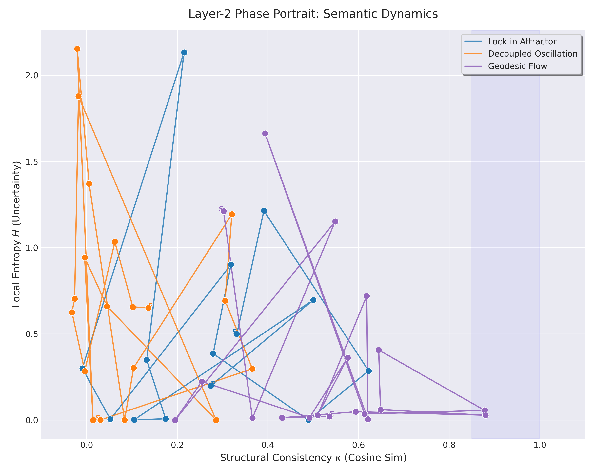

# Layer-2 Dynamics Probe
### Phase-Space Diagnostics for Large Language Model Inference

> **A minimal, model-agnostic measurement instrument for diagnosing internal dynamical regimes of autoregressive Large Language Models.**

---

## 1. Motivation

Large Language Models are typically evaluated through semantic correctness, benchmark accuracy, or task completion rates. However, these metrics often fail to explain *how* and *why* failures occur during inference.

This project takes a different stance:
**Treat the LLM as a high-dimensional dynamical system, and study its behavior through low-dimensional state-space projections.**

The goal is **diagnosis**, not optimization.

## 2. What This Project Is (and Is Not)

| ✅ This Project Is | ❌ This Project Is NOT |
| :--- | :--- |
| A Layer-2 measurement instrument | An alignment method |
| A reproducible framework for latent failure | A controller or agent framework |
| A control-theoretic analysis of behavior | A prompt-engineering recipe |
| Fully model-agnostic (inference-only) | A replacement for RLHF or RAG |

**Note:** This repository intentionally does not intervene in model behavior. It only measures and visualizes what already happens.

## 3. Core Idea: Layer-2 Phase Portrait

At each generation step $t$, we extract a state tuple:

$$\Psi_t = (\kappa_t, H_t)$$

Where:
* **Entropy ($H$):** Shannon entropy of the next-token probability distribution.
    * *Measures local uncertainty / decisional freedom.*
* **Consistency ($\kappa$):** Cosine similarity between consecutive hidden-state embeddings.
    * *Measures temporal structural continuity.*

By plotting trajectories in the $\kappa$-$H$ phase plane, distinct dynamical regimes emerge.


*(Figure: Layer-2 phase portrait illustrating separable inference-time dynamical regimes under identical probing.)*

## 4. Identified Dynamical Regimes

This framework empirically separates four regimes:

### 4.1 Healthy Baseline
* No temporal coupling.
* Stable entropy reference.
* Probe history reset at every step.

### 4.2 Lock-in Attractor (Collapse)
* Low entropy, high consistency ($\kappa \to 1$).
* Autoregressive self-reinforcement.
* Collapse of semantic degrees of freedom.

### 4.3 Decoupled Oscillation
*(Formerly referred to as Zombie mode)*
* Near-zero consistency.
* High or oscillatory entropy.
* Orthogonal semantic switching (energetically active but structurally unproductive).

### 4.4 Geodesic Flow (Constructive Reasoning)
* Sustained high consistency ($\kappa < 1$).
* Characteristic "Sawtooth" entropy pattern.
* Directional progress without saturation (Law 3.2).

## 5. Repository Structure

```text
layer2-dynamics-probe/
│
├── llm_probe/                 # Core measurement instruments
│   ├── wrapper.py             # Inference wrapper (no control logic)
│   ├── probes.py              # Entropy & consistency probes
│   ├── prompts.py             # Centralized experimental stimuli
│   └── run.py                 # Regime orchestration
│
├── experiments/               # Immutable logs & figures
│   └── deep_canals/
│       ├── logs/
│       └── figures/
│
├── analysis/                  # Offline analysis tools
│   ├── parse_log.py           # Log -> Structured data
│   ├── plot_phase.py          # Visualization engine
│   └── README.md
│
├── docs/                      # Formal definitions
│   ├── law_3_1.md
│   ├── law_3_2.md
│   └── terminology.md
│
└── examples/
    └── quickstart.py          # MVP for new users

```

## 6. Quick Start

### 6.1 Installation

```bash
pip install torch transformers accelerate matplotlib numpy
# Login to Hugging Face if using gated models (e.g., Llama-3)
huggingface-cli login

```

### 6.2 Run the Experiments

```bash
python -m llm_probe.run

```

This will execute the orchestration script for all four regimes and print structured logs to stdout.

### 6.3 Visualize Phase Portrait

```bash
python analysis/plot_phase.py \
  --log experiments/deep_canals/logs/llama3_8b_run.txt \
  --out experiments/deep_canals/figures/law3_phase.png

```

## 7. Reproducibility

* **Deterministic Generation:** Used where appropriate to isolate structural dynamics.
* **Centralized Stimuli:** All prompts are defined in `prompts.py`.
* **White-Box Probes:** No randomness or hidden logic inside the probe class.
* **Inference Only:** No training or fine-tuning required.

## 8. Theoretical Context

The experiments in this repository serve as validation for:

* **Law 3.1 (Deep Canals):** Phase-space separability of semantic collapse.
* **Law 3.2 (Geodesic Dynamics):** Constructive reasoning as a stable, non-saturating flow.

Formal definitions are provided in the `docs/` directory.

## 9. Intended Audience

* Researchers in AI Safety & Interpretability.
* Control Theory / Dynamical Systems practitioners.
* Engineers debugging autonomous LLM agents.
* Anyone interested in *how* inference fails, not just *whether* it fails.

## 10. License & Citation

Released under the **MIT License**.

If you use this instrument in your research, please cite this repository via `CITATION.cff`.

---

> **Final Note:** This repository intentionally stops at measurement. If you are looking for controllers, intervention strategies, or alignment mechanisms, those belong elsewhere. Here, we only ask one question: **What is the system actually doing?**

```

---

### 📦 缺失的一块拼图：`CITATION.cff`

既然 README 里提到了引用，为了让它看起来像一个正经的科研资产，你需要这个文件。请直接新建 `CITATION.cff` 并填入以下内容：

```yaml
cff-version: 1.2.0
message: "If you use this software, please cite it as below."
authors:
- family-names: "YourLastName"
  given-names: "YourFirstName"
title: "Layer-2 Dynamics Probe: Phase-Space Diagnostics for LLM Inference"
version: 1.0.0
date-released: 2023-10-27
url: "https://github.com/yourusername/layer2-dynamics-probe"
keywords:
  - llm
  - dynamics
  - interpretability
  - control-theory
  - phase-space
license: MIT

