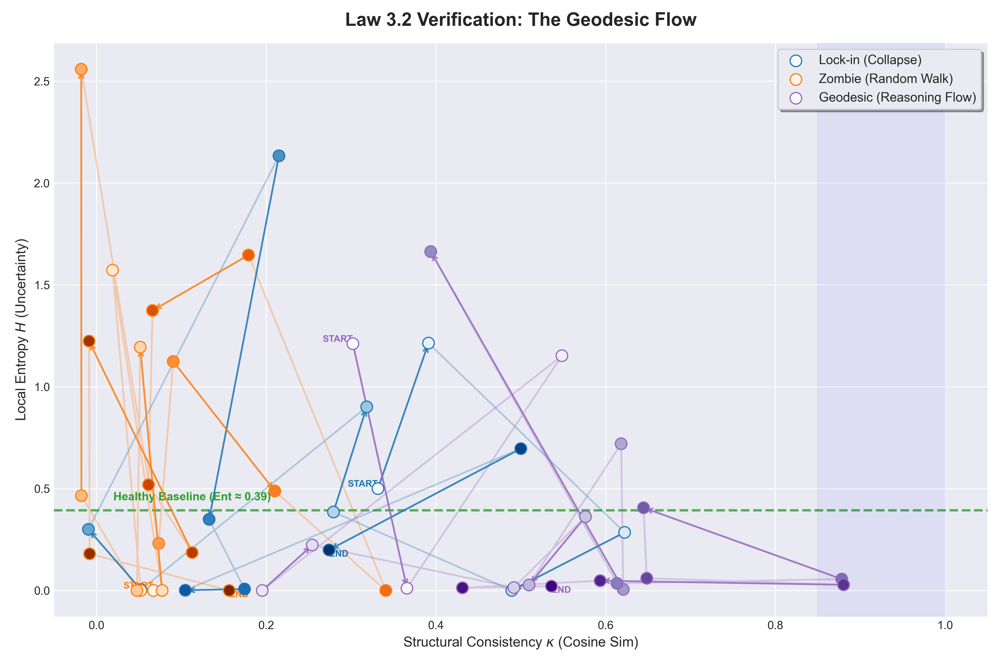

# Law 3.2 — Geodesic Dynamics  
### Constructive Inference as Non-Saturating Flow

## Status
Empirical Law  
Validated via inference-time Layer-2 diagnostics

---

## 1. Statement of the Law

**Law 3.2 (Geodesic Dynamics):**

> During constructive inference, large language models exhibit a
> stable, directional trajectory in Layer-2 phase space that preserves
> structural continuity without saturation and avoids convergence into
> collapse attractors.

Formally, during inference, the state trajectory  
\[
\Psi_t = (\kappa_t, H_t)
\]  
satisfies the following conditions over extended horizons:

- Structural consistency κ remains persistently high but **strictly less than 1**
- Local entropy H exhibits alternating increases and decreases rather than monotonic decay
- The trajectory advances without settling into a fixed point or narrow basin

This dynamical regime is termed **Geodesic Dynamics**.

---

## 2. Motivation

Long-horizon inference in large language models is often treated as
inherently unstable or pathological, especially in contrast to short,
single-step outputs.

However, empirical observation shows that some extended generations
remain coherent, progressive, and non-repetitive without external
intervention.

Law 3.2 provides a **dynamical criterion** to distinguish such
constructive inference from both collapse (Law 3.1) and unstructured
wandering, based solely on inference-time observables rather than task
success or correctness.

---

## 3. Geodesic Interpretation

In this context, *geodesic* does **not** imply:

- Global optimality
- Shortest paths in an objective or reward sense
- Algorithmic efficiency or correctness guarantees

Instead, it denotes a **locally valid trajectory under structural
constraints**, where inference proceeds while preserving latent
continuity and avoiding saturation.

In this regime:

- New semantic or structural constraints are intermittently introduced  
  (local entropy increase)
- Partial resolution and consolidation follow  
  (local entropy decrease)
- Latent alignment remains strong but non-saturating  
  (κ < 1)

The resulting motion resembles constrained flow across a semantic
manifold rather than convergence toward an attractor.

---

## 4. Empirical Signature

Geodesic Dynamics are identified by the following reproducible
Layer-2 signature:

| Metric      | Observed Behavior                         |
|-------------|-------------------------------------------|
| κ           | High, stable, non-saturating               |
| H           | Oscillatory with bounded amplitude         |
| Trajectory  | Directional flow without attractor entry  |

This pattern is observed consistently in structured deductive and
multi-step inference tasks, independent of output correctness.

---

## 5. Empirical Verification

The following figure shows an empirical trajectory exhibiting Geodesic
Dynamics under controlled inference conditions:



*Figure: Empirical verification of Geodesic Dynamics.  
The trajectory maintains high but non-saturating consistency (κ < 1)
with a characteristic sawtooth entropy pattern, advancing without
convergence into a collapse attractor.*

This figure serves as **regime-specific evidence**, not as a global
system overview. The full phase-space context is provided separately in
the repository root.

---

## 6. Sawtooth Entropy Pattern

A defining characteristic of Geodesic Dynamics is a **sawtooth entropy
profile**, composed of alternating phases:

1. **Expansion Phase**  
   Introduction of new semantic or structural constraints  
   (H increases)

2. **Contraction Phase**  
   Local consolidation or resolution of constraints  
   (H decreases)

The persistence of this alternation distinguishes Geodesic Flow from
both monotonic collapse and stochastic fluctuation.

---

## 7. Failure Mode: Soft Lock-In

When structural consistency gradually approaches saturation (κ → 1):

- Entropy oscillations dampen
- Effective semantic branching diminishes
- Inference degenerates into self-consistent restatement

This transition marks a **Soft Lock-In**, representing the boundary
between Geodesic Dynamics and the collapse regime defined in Law 3.1.

---

## 8. Scope and Limitations

- Law 3.2 applies exclusively to **inference-time dynamics**
- It does not imply correctness, optimality, or task success
- It does not prescribe decoding strategies, interventions, or controls

This law describes *how inference unfolds*, not *whether it reaches a
correct conclusion*.

---

## 9. Relation to Law 3.1

Law 3.1 and Law 3.2 define complementary regions of Layer-2 phase space:

- **Law 3.1 (Deep Canals)** characterizes convergence into collapse
  attractors under autoregressive self-reinforcement
- **Law 3.2 (Geodesic Dynamics)** characterizes sustained flow that
  preserves structure without saturation

Together, they define the boundary between pathological and constructive
inference regimes.

---

## 10. Reproducibility

Geodesic Dynamics can be reproduced using the standard probe runner:

```bash
python -m llm_probe.run
```

with prompts designed to induce multi-step constrained inference, as
defined in `llm_probe/prompts.py`.

No fine-tuning, auxiliary supervision, or reward modeling is required.

---

## 11. Summary

Law 3.2 formalizes constructive inference in large language models as a
**non-equilibrium, non-saturating dynamical process** observable in
Layer-2 phase space.

Inference remains productive not by minimizing entropy, but by
**regulating entropy while preserving latent structural continuity**.


